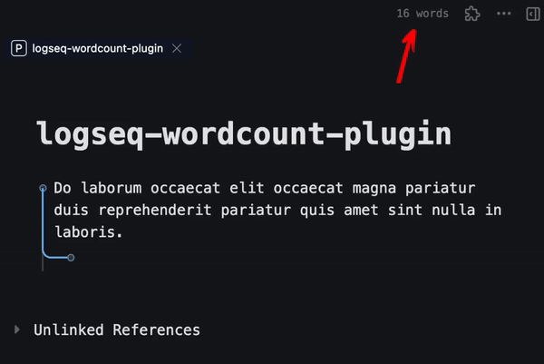
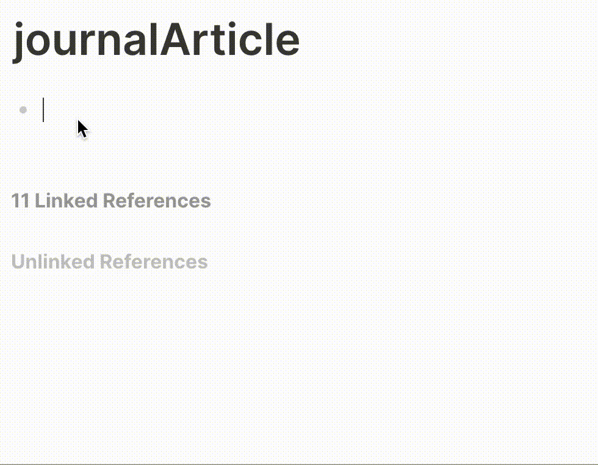

# logseq-wordcount-plugin
  

> Simple word and character counter that calculates the number of words across nested blocks",

---

## ✨ Features
- Count either word or characters across all nested blocks. Supports deeply nested blocks.
- Count words on a page level.
- Set a writing target and measure your progress.

## 📸 Screenshots / Demo
#### Word count


#### Page-level word count


#### Writing target


## ⚙️ Installation
1.  Open Logseq.
2.  Go to the **Marketplace** (Plugins > Marketplace).
3.  Search for **logseq-todoist-plugin**.
4.  Click **Install**.

## 🛠 Usage & Settings
- Use `/Word count`. It will then count the number of words below this parent block. This supports an unlimited number of nested blocks.
- You can use more than 1 word counter in a single page. Just prefix the blocks you would like to count with another `/Word count`.
- It also supports counting sentences that have both English and Chinese/ Japanese words. E.g. `敏捷的棕色狐狸跳过了懒狗 is a funny phrase` returns 16 words.
- You can also use `/Character count` to count the number of characters (including spaces) instead of words.
- Turn on the "Wordcount Toolbar" setting and total word count of the page will be displayed in the toolbar.

#### Styling the wordcount button
You can style the wordcount button using the class `.wordcount-btn`. Simply add it into your `custom.css`.

Example:
```css
.wordcount-btn {
    border-color: red;
    font-size: 2em;
}
```

#### Customising text in the wordcount button
Go to plugin settings, and make the changes as you like.


#### Migrating from Roam
Roam uses `{{word-count}}`. All you need to do is to replace each instance of `{{word-count}}` with `{{renderer :wordcount_abc123}}` (abc123 can be any other string you want). You can also a use a terminal command (in MacOS or Linux) to do so. In terminal, navigate to the folder (e.g. pages) and run the following command.

```bash
find . -type f -name '*.md' -exec sed -i '' s/word-count/renderer\ :wordcount_abc123/g {} +
```

## ☕️ Support
If you enjoy this plugin, please consider supporting the development!

<div align="center">
  <a href="https://github.com/sponsors/benjypng"></a>&nbsp;<a href="https://www.buymeacoffee.com/hkgnp.dev"></a>
</div>

## 🤝 Contributing
Issues are welcome. If you find a bug, please open an issue. Pull requests are not accepted at the moment as I am not able to commit to reviewing them in a timely fashion.

## ❤️ Credits
[pengx17](https://github.com/pengx17) for his suggestions and [Ken Lee](https://stackoverflow.com/users/11854986/ken-lee) for his word counting algorithm.
