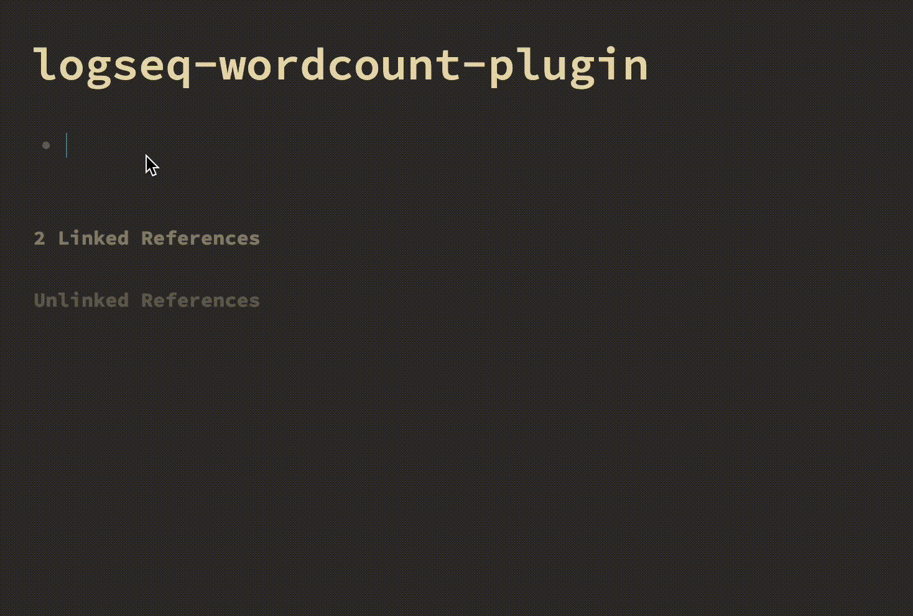

> v1.4 now allows the counting to be done on the homepage too!

=======

> > > > > > > 236abe394bba60c0feafb0f0d12692ad22a74173

# Introduction



# Usage

Use `/wordcount`. It will then count the number of words below this parent block. This supports an unlimited number of nested blocks.

You can use more than 1 wordcounter in a single page. Just prefix the blocks you would like to count with another `/wordcount`.

It also supports counting sentences that have both English and Chinese/ Japanese words.
E.g. `敏捷的棕色狐狸跳过了懒狗 is a funny phrase` returns 16 words.

Happy counting!

# Styling the Wordcount button

You can style the wordcount button using the class `.wordcount-btn`. Simply add it into your `custom.css`.

Example:

```
.wordcount-btn {
    border-color: red;
    font-size: 2em;
}
```

# Installation

**Option 1**
Install from the Logseq marketplace.

**Option 2**

Clone the repository.
Run `npm i && npm run build` and manually load the plugin in Logseq.

**Option 3**

Download the [latest release](https://github.com/hkgnp/logseq-wordcount-plugin/releases) and after extracting the zip file, manually load the plugin in Logseq.

# Help

Please look for me on Discord or open an issue if you have any feedback!

# Credits

[pengx17](https://github.com/pengx17) for his suggestions and [Ken Lee](https://stackoverflow.com/users/11854986/ken-lee) for his word counting algorithm.
