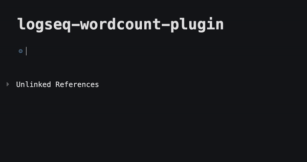

# Introduction

# Usage

Use `/wordcount`. It will then count the number of words below this parent block. This supports an unlimited number of nested blocks.

You can use more than 1 wordcounter in a single page. Just prefix the blocks you would like to count with another `/wordcount`.

It also supports counting sentences that have both English and Chinese words.
E.g. `敏捷的棕色狐狸跳过了懒狗 is a funny phrase` returns 16 words.

Happy counting!

(Please note that this plugin only works on journal pages and regular pages. It does not work on the homepage yet.)

# Installation

Run `npm i && npm run build` and manually load plugin in Logseq

# Credits

[pengx17](https://github.com/pengx17) for his suggestions and [Ken Lee](https://stackoverflow.com/users/11854986/ken-lee) for his word counting algorithm.
